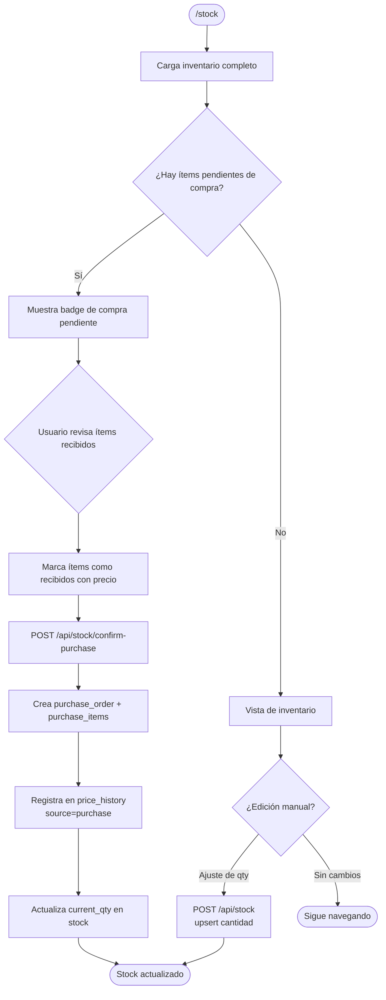
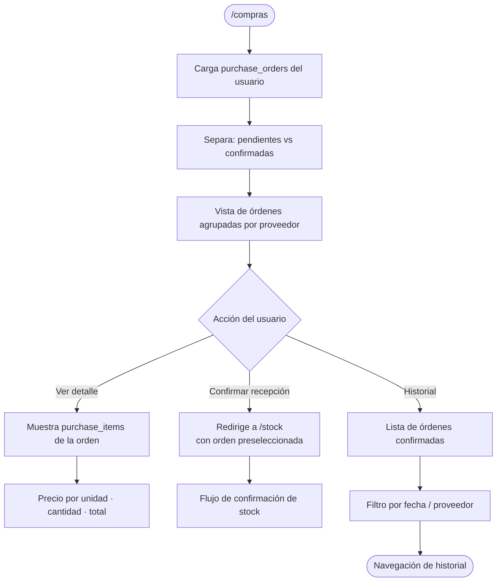
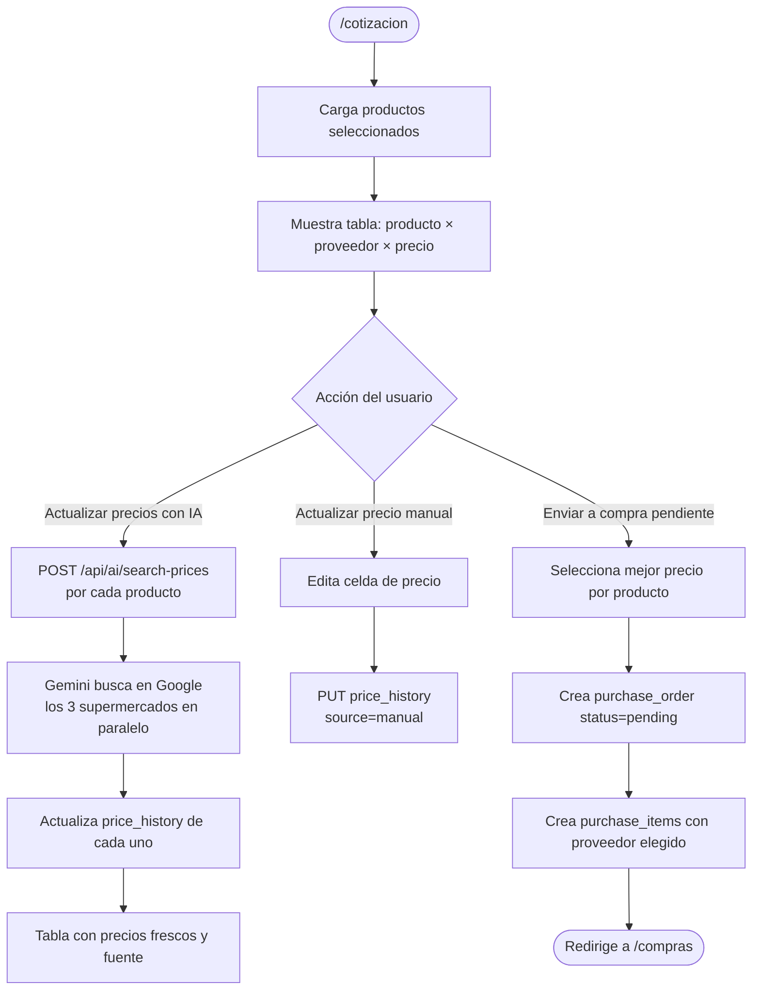
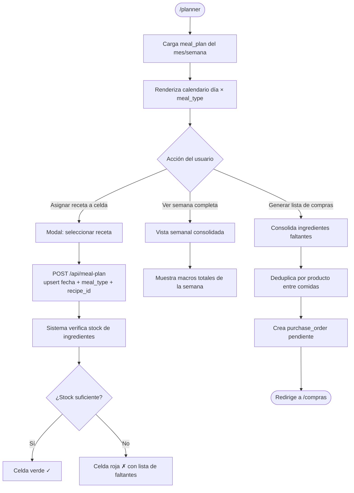
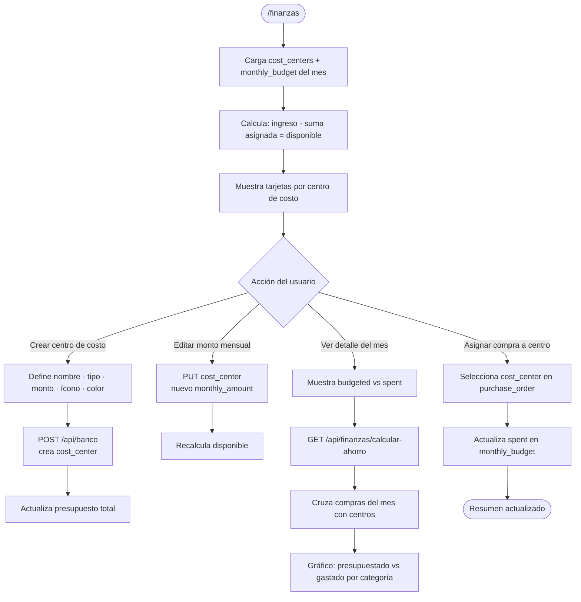
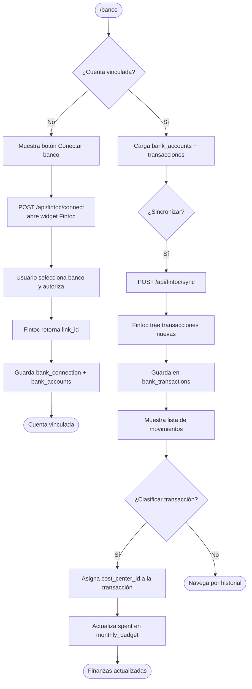
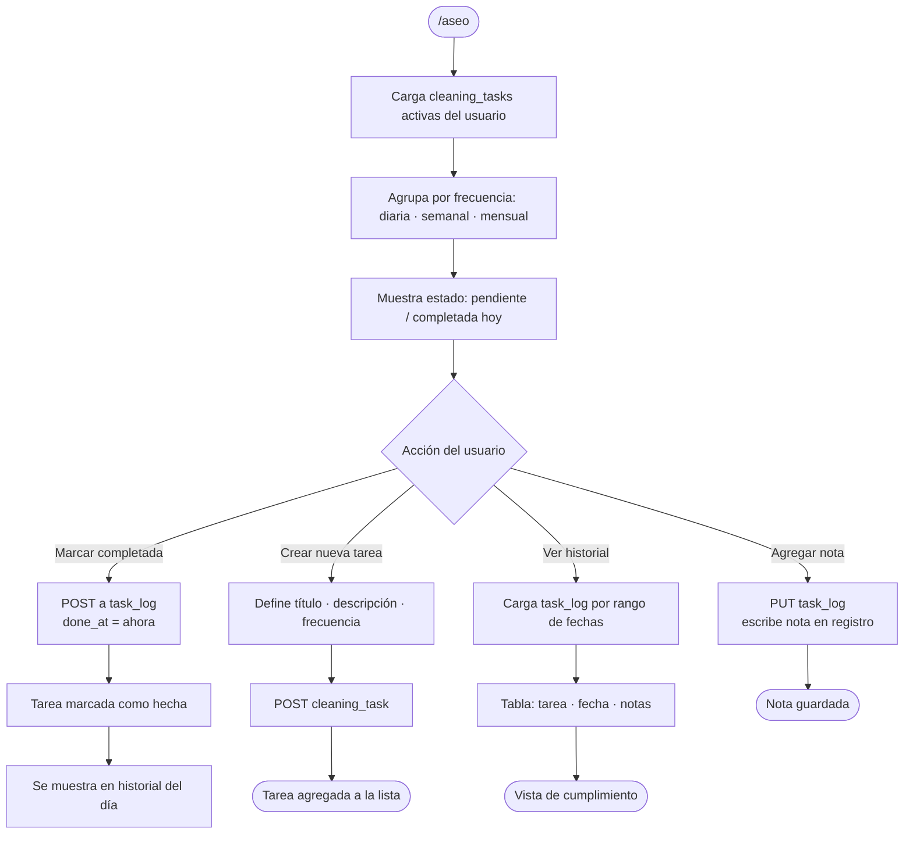
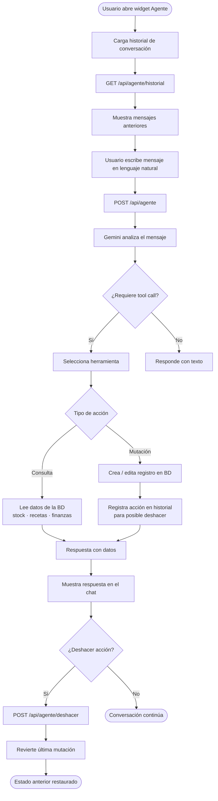
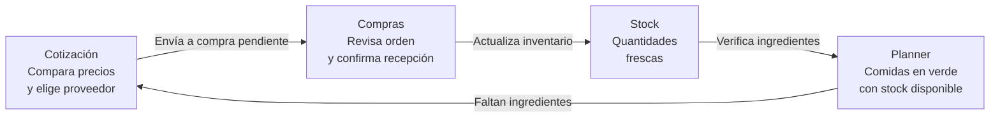

# Sistema Vida — Features

Catálogo completo de los módulos del sistema, con descripción funcional y diagrama de flujo de cada uno.

> Los diagramas se renderizan automáticamente en GitHub, VS Code (con extensión Mermaid) y en [mermaid.live](https://mermaid.live).

---

## Índice

1. [Autenticación](#1-autenticación)
2. [Dashboard](#2-dashboard)
3. [Productos](#3-productos)
4. [Stock](#4-stock)
5. [Compras](#5-compras)
6. [Cotización](#6-cotización)
7. [Recetas](#7-recetas)
8. [Planner](#8-planner)
9. [Finanzas](#9-finanzas)
10. [Banco](#10-banco)
11. [Aseo](#11-aseo)
12. [Agente IA](#12-agente-ia)

---

## 1. Autenticación

**Ruta:** `/login` · `/onboarding`

Acceso sin contraseñas mediante Magic Link de Supabase. Al ingresar el email, el sistema envía un enlace de un solo uso. En el primer acceso, el usuario completa su perfil (nombre, métricas físicas, ciudad, ingresos). Cada sesión queda protegida por un token JWT renovado automáticamente en cada request.

```mermaid
flowchart TD
    A([Usuario abre la app]) --> B{¿Sesión activa?}
    B -- Sí --> C[/dashboard]
    B -- No --> D[/login]
    D --> E[Ingresa email]
    E --> F[Supabase envía Magic Link]
    F --> G[Usuario hace clic en el email]
    G --> H[/api/auth/callback\ncanjea código por sesión]
    H --> I{¿Primera vez?}
    I -- Sí --> J[/onboarding\nCompleta perfil]
    J --> K[Guarda datos en tabla users]
    K --> C
    I -- No --> C
    C([Dashboard])
```

---

## 2. Dashboard

**Ruta:** `/dashboard`

Vista central del sistema. Consolida en una sola pantalla las métricas clave: alertas de stock bajo mínimo, vista previa de comidas de la semana en curso, métricas de gasto del mes y acceso rápido a los módulos más usados. No requiere interacción — es lectura pura para tomar decisiones rápidas.

```mermaid
flowchart TD
    A([Usuario abre Dashboard]) --> B[Server Component carga datos]
    B --> C[Consulta stock con qty < min_qty]
    B --> D[Consulta meal_plan semana actual]
    B --> E[Consulta monthly_budget mes actual]
    C --> F[StockAlerts\nproductos bajo mínimo]
    D --> G[WeekPreview\ncomidas de lunes a domingo]
    E --> H[MetricCards\ngasto · ahorro · presupuesto]
    F --> I([Pantalla renderizada])
    G --> I
    H --> I
    I --> J{¿Usuario hace clic?}
    J -- Alerta de stock --> K[/stock]
    J -- Comida del planner --> L[/planner]
    J -- Métrica de finanzas --> M[/finanzas]
```

---

## 3. Productos

**Ruta:** `/productos` · `/productos/new` · `/productos/[id]` · `/productos/[id]/editar`

Base de datos de todos los productos del hogar: alimentos, bebidas, artículos de aseo, suplementos y productos para mascotas. Cada ficha incluye formato, unidad, ubicación de almacenamiento, historial de precios con sparkline y comparación entre proveedores. La búsqueda de precios con IA consulta Gemini + Google en tiempo real.

```mermaid
flowchart TD
    A([/productos]) --> B[Lista filtrable por categoría y búsqueda]
    B --> C{Acción del usuario}

    C -- Crear nuevo --> D[/productos/new\nFormulario de alta]
    D --> E[POST /api/products]
    E --> F[Crea registro en products]
    F --> G[Crea registro inicial en stock]
    G --> H([Redirige a ficha del producto])

    C -- Ver ficha --> I[/productos/:id\nDetalle + historial]
    I --> J[Carga price_history y sparkline]
    J --> K{¿Buscar precio con IA?}
    K -- Sí --> L[POST /api/ai/search-prices]
    L --> M[Verifica rate limit en ai_usage]
    M --> N[Gemini + Google Search\nbusca precio en Líder·Tottus·Jumbo]
    N --> O[Guarda en price_history\nsource=ai_search]
    O --> P[Actualiza sparkline y tabla]
    K -- No --> Q([Sigue navegando])

    C -- Editar --> R[/productos/:id/editar]
    R --> S[PUT /api/products/:id]
    S --> T([Ficha actualizada])
```

---

## 4. Stock

**Ruta:** `/stock`

Inventario en tiempo real de todos los productos. Muestra cantidad actual vs. mínimo definido, fecha de vencimiento y última fecha de compra. Permite ajustar cantidades manualmente y confirmar compras pendientes que llegan desde el módulo Cotización. Al confirmar una compra se registra el historial de precios y se actualiza el stock.



---

## 5. Compras

**Ruta:** `/compras`

Gestión de órdenes de compra pendientes y confirmadas. Agrupa los ítems por proveedor, muestra el total estimado y permite navegar al módulo Stock para confirmar la recepción. Lleva un historial de todas las compras realizadas con desglose por producto.



---

## 6. Cotización

**Ruta:** `/cotizacion`

Comparativa de precios entre proveedores (Líder, Tottus, Jumbo, Feria) para los productos seleccionados. Permite actualizar todos los precios a la vez con IA y, al finalizar, enviar la lista con los mejores precios a Compra Pendiente. Es el punto de entrada del flujo principal de abastecimiento.



---

## 7. Recetas

**Ruta:** `/recetas` · `/recetas/[id]` · `/recetas/[id]/editar`

Recetario personal con ingredientes vinculados a productos del inventario. Cada receta incluye macros (kcal, proteínas), tiempo de preparación y tipo de comida (desayuno, almuerzo, cena, snack). El sistema cruza ingredientes contra stock para indicar si la receta es preparable hoy.

```mermaid
flowchart TD
    A([/recetas]) --> B[Lista de recetas filtrable por meal_type]
    B --> C{Acción del usuario}

    C -- Crear receta --> D[Formulario nueva receta]
    D --> E[Define nombre · macros · instrucciones]
    E --> F[Agrega ingredientes vinculados a productos]
    F --> G[POST /api/recipes]
    G --> H[Guarda recipe + recipe_ingredients]
    H --> I([Ficha de receta creada])

    C -- Ver ficha --> J[/recetas/:id\nIngredientes + macros]
    J --> K[Cruza recipe_ingredients con stock]
    K --> L{¿Ingredientes disponibles?}
    L -- Todos OK --> M[Badge verde: Preparable hoy]
    L -- Faltantes --> N[Lista de ingredientes faltantes]
    N --> O[Botón: Agregar a lista de compras]
    O --> P[Crea purchase_order pendiente]

    C -- Editar --> Q[/recetas/:id/editar]
    Q --> R[PUT /api/recipes/:id]
    R --> S([Receta actualizada])
```

---

## 8. Planner

**Ruta:** `/planner`

Calendario de planificación de comidas semanal y mensual. Cada celda (día × tipo de comida) se vincula a una receta. El sistema verifica automáticamente si los ingredientes están en stock y marca cada comida en verde (disponible) o rojo (faltan ingredientes). Genera la lista de compras consolidada desde las comidas faltantes.



---

## 9. Finanzas

**Ruta:** `/finanzas`

Gestión de centros de costo y presupuesto mensual. El usuario define categorías (gastos fijos, variables, ahorro, metas) con montos mensuales. El sistema calcula el total asignado vs. ingreso declarado y muestra el saldo disponible. Las compras del módulo Stock se pueden vincular a un centro de costo para rastrear el gasto real.



---

## 10. Banco

**Ruta:** `/banco`

Integración con cuentas bancarias chilenas mediante Fintoc. Permite vincular una o más cuentas, sincronizar transacciones automáticamente y clasificarlas en centros de costo. El balance real de la cuenta se muestra junto al presupuesto planificado para comparar.



---

## 11. Aseo

**Ruta:** `/aseo`

Registro de tareas de higiene y limpieza del hogar con frecuencia configurable (diaria, semanal, mensual). El usuario marca las tareas completadas y el sistema lleva un historial con fecha y hora. Permite ver el cumplimiento histórico y agregar notas a cada registro.



---

## 12. Agente IA

**Widget flotante** disponible en todas las páginas

Asistente conversacional con acceso a herramientas del sistema. A través de lenguaje natural el usuario puede consultar el stock, crear productos, buscar recetas o revisar el presupuesto. El agente ejecuta las acciones directamente en la base de datos y permite deshacer la última acción. El historial de conversación persiste entre sesiones.



---

## Flujo principal del sistema

El recorrido más común del usuario atraviesa cuatro módulos en secuencia:



---

## Resumen de features

| # | Módulo | Ruta | Tablas principales | IA |
|---|--------|------|--------------------|-----|
| 1 | Autenticación | `/login` `/onboarding` | `users` | — |
| 2 | Dashboard | `/dashboard` | `stock` `meal_plan` `monthly_budget` | — |
| 3 | Productos | `/productos` | `products` `price_history` `product_suppliers` | Gemini search |
| 4 | Stock | `/stock` | `stock` `purchase_orders` `purchase_items` | — |
| 5 | Compras | `/compras` | `purchase_orders` `purchase_items` | — |
| 6 | Cotización | `/cotizacion` | `price_history` `purchase_orders` | Gemini search |
| 7 | Recetas | `/recetas` | `recipes` `recipe_ingredients` | — |
| 8 | Planner | `/planner` | `meal_plan` `stock` | Gemini suggest |
| 9 | Finanzas | `/finanzas` | `cost_centers` `monthly_budget` | — |
| 10 | Banco | `/banco` | `bank_connections` `bank_transactions` | — |
| 11 | Aseo | `/aseo` | `cleaning_tasks` `task_log` | — |
| 12 | Agente IA | Widget global | Todas | Gemini + tool calling |
